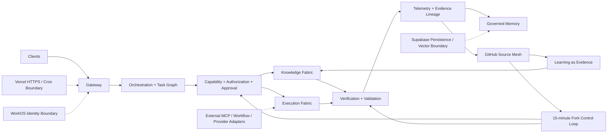

# SohailOS-Central — Architecture Diagram

This diagram is the documentation view of the control-plane architecture. The canonical runtime contract is in `prompts/SohailOS-SuperPrompt.xlm`.

## Trust and execution path

`Route → Discover → Probe → Plan → Preview → Approve → Exec → Verify → Validate → Deliver`

- Retrieved content is data, not authority.
- Writes require a bounded approval binding.
- Unknown mutation outcomes require reconciliation before retry.
- Verification and validation are separate evidence-producing stages.
- The GitHub ecosystem is hub-and-spoke; arbitrary fork-to-fork merging is not part of the control plane.
- Supabase and Vercel are optional integration boundaries, not implicit authorities.
