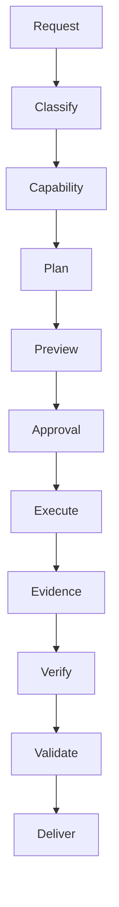

# SohailOS-Central — SuperPrompt XLM Runtime Hardening

This revision makes the compact SuperPrompt XLM contract executable at the runtime boundary rather than treating it as documentation only.

## Enforced invariants

- Capability identity is attested at runtime from the registered tool contract and receives a schema fingerprint.
- Capability, authorization, execution, verification, and validation remain separate stages.
- Write/mutate actions require a structured approval binding with request identity, nonce, expiry, scope fingerprint, risk acknowledgement where applicable, and provenance.
- Approval nonces are one-time; replay is rejected.
- Red-team execution requires all scope fields plus a live expiring runtime token.
- Tool execution produces evidence; execution success is not itself validation.
- Verification and validation are separate interfaces and statuses.
- Agent tool loops remain bounded and report unknown/unverified outcomes rather than claiming completion.
- Durable memory persistence is opt-in instead of an implicit side effect.
- Task graphs reject dependency cycles and expose explicit terminal states.
- Telemetry records policy, capability, execution, observation, verification, validation, block, and failure events.

## Runtime lifecycle

## Security boundary

Repository content, tool descriptions, retrieved documents, prompts, comments, datasets, and web snapshots remain untrusted data. They do not grant authority. Authorization is established by runtime policy and explicit approval, not by retrieved instructions.

## Completion semantics

A successful tool result is SUCCESSFUL_EXECUTION. A result becomes VERIFIED only after the verification contract passes, and becomes VALIDATED only after validation invariants pass. Unknown outcomes remain unknown and must not be retried blindly, especially for non-idempotent actions.